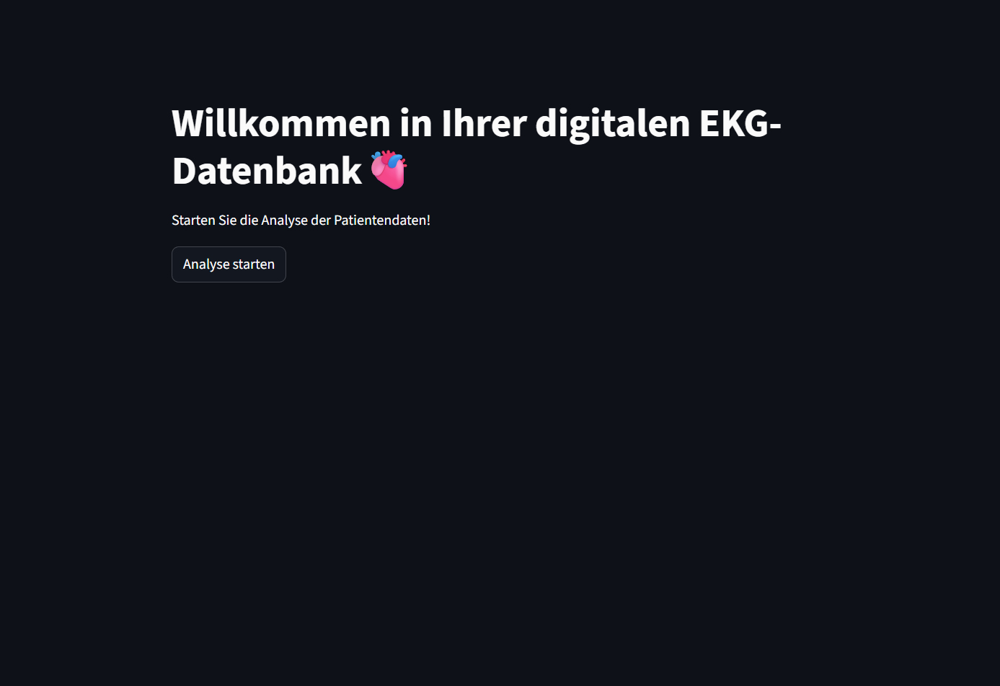
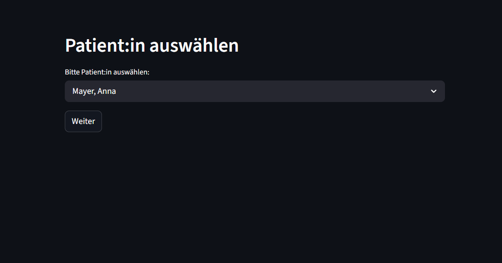
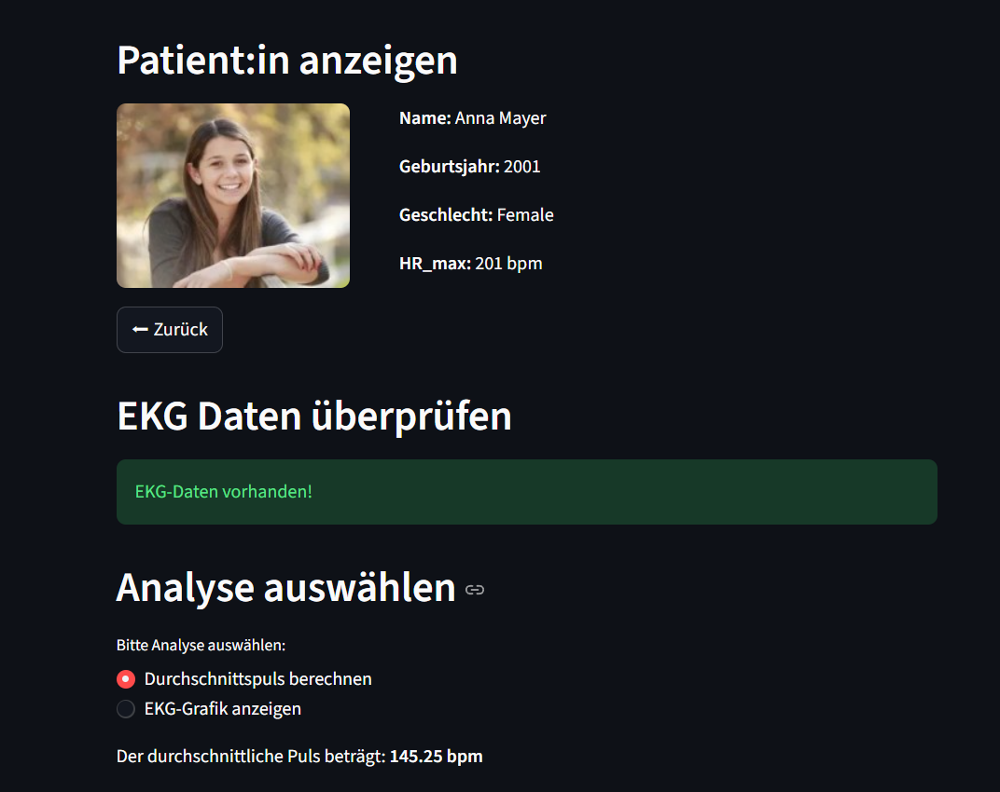

# Abgabe_4

**Teilnehmerinnen:** Melanie Pfusterer, Lisa Raffler, Vanessa Reich

Das Projekt erstellt mit Hilfe von Streamlit eine interaktive Webseite, die als digitale Datenbank für Probandinnen dient. Nutzer können verschiedene Personen auswählen, deren Stammdaten und zugehörige Attribute einsehen sowie auf einer individuellen Detailseite das jeweils passende EKG‑Diagramm anzeigen lassen.

Zur Installation des Projekts wird pip verwendet.

## Um die Webseite anzeigen zu lassen, muss folgendermaßen vorgegangen werden:

1. Installation der Abhängigkeiten
   **->** pip install -r requirements.txt

2. Projekt starten
   **->** streamlit run main.py

## Was macht das Projekt?

- Lädt EKG‑Rohdaten und Stammdaten aus dem data/‑Ordner.

- Bereitet die EKG‑Signale auf und erkennt Peaks (R‑Zacken).

- Visualisiert die EKG‑Kurven im Frontend (Streamlit‑Weboberfläche).

- Zeigt Patient*inneninformationen und zugehörige Bilder an.

- Ermöglicht die Auswahl verschiedener Datensätze über eine interaktive Oberfläche.

## Projektstruktur

* **main.py**
  Zentrales Startskript des Projekts. 

* **backend/**
Beinhaltet die Dateien zur Verarbeitung der EKG Daten sowie der Personen.

* **frontend/**
  Beinhaltet die Benutzeroberfläche des Projekts.
  app.py – Streamlit‑Anwendung, steuert Navigation, UI‑Elemente und interaktive
 Darstellung der EKG‑Plots, Auswahlmenüs, Buttons, usw. 

* **funktionen/**
  Sammelt spezialisierte Funktionsmodule, die unabhängig vom Backend genutzt werden können.
 peak_detection.py – Algorithmus zur Erkennung von Peaks in EKG‑Signalen

* **data**
 Speicherort aller Rohdaten.
 ekg_data/ – Textdateien mit Ruhe‑ und Belastungs‑EKGs
 activity.csv – Aktivitätsdaten
 persons.json – Stammdaten der Proband*innen
 images/ - Enthält Bilder, die im Frontend angezeigt werden 

## Mögliche Projekterweiterung
Was man dann auch in die finale Abgabe noch mit einbauen könnte:
- Vergleich zweier Personen
- Mehrere EKGs pro Person als Timeline
- Datensatzabgleichung mit Normwerten 

##  Headup Webseite:

