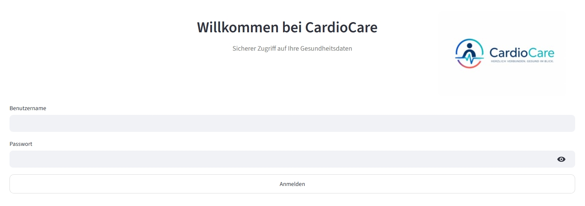
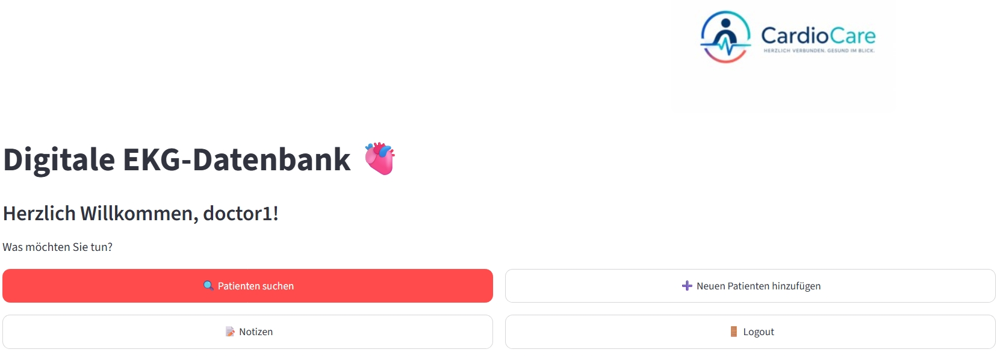
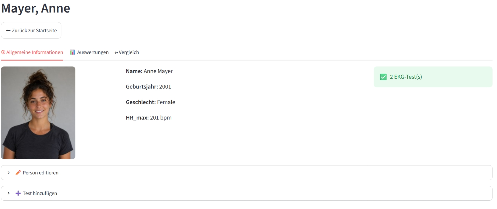
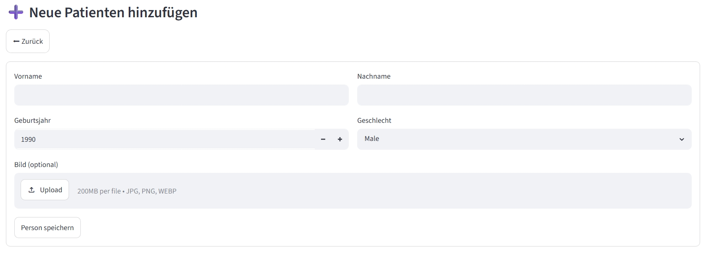
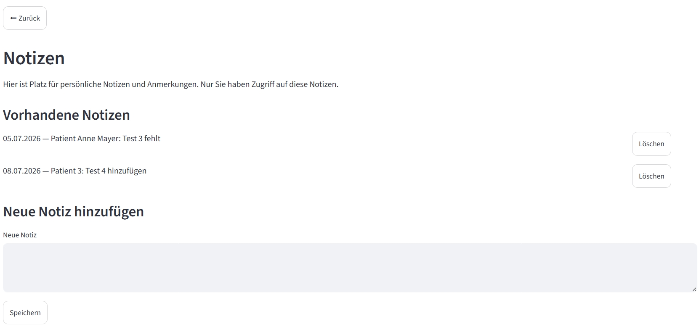
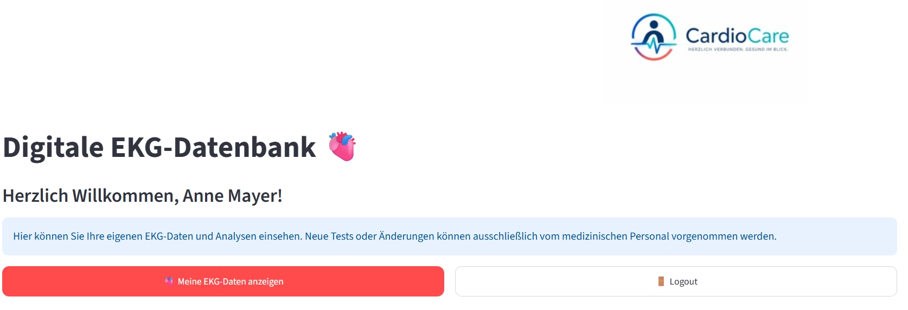
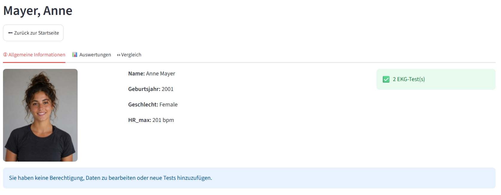

# 🫀 CardioCare — Digitale EKG-Datenbank

*Entwickelt von Melanie Pfusterer, Lisa Raffler & Vanessa Reich*

---

## Inhaltsverzeichnis

- [Über das Projekt](#über-das-projekt)
- [Funktionen](#funktionen)
- [Screenshots](#screenshots)
- [Tech-Stack](#tech-stack)
- [Projektstruktur](#projektstruktur)
- [Installation](#installation)
- [Nutzung](#nutzung)
- [Datenmodell](#datenmodell)
- [Sicherheit](#sicherheit)


---

## Über das Projekt

**CardioCare** ist eine digitale EKG-Webanwendung für medizinisches Personal und Patient*innen. Die Anwendung
ermöglicht die zentrale Verwaltung von Patientenprofilen, den Upload und die Auswertung von EKG-Aufzeichnungen
(als `.txt`-Rohdaten oder `.fit`-Aktivitätsdateien) sowie den visuellen Vergleich mehrerer Tests inklusive
automatischer Peak- und HRV-Berechnung.

Die App unterscheidet strikt zwischen drei Rollen: **Admin**, **Doctor** und **Patient**. Sie zeigt
abhängig von der Rolle jeweils nur die passenden Funktionen und Daten an.

## Funktionen

| Funktion | Beschreibung |
|----------|--------------|
| 🔐 **Login & Rollen** | Anmeldung für `admin`, `doctor` und `patient` mit SHA-256-gehashten Passwörtern und automatischer Migration alter Klartext-Passwörter |
| 🧑‍🤝‍🧑 **Patientenverwaltung** | Anlegen, Suchen, Bearbeiten und Löschen von Patient*innenprofilen inkl. Profilbild |
| 📤 **EKG-Upload** | Hinzufügen neuer Tests im Format `.txt` oder `.fit` |
| 📊 **Analyse** | Automatische Peak-Erkennung, Herzfrequenz- und HRV(RMSSD)-Berechnung sowie interaktive Zeitreihen-Plots |
| ↔️ **Vergleichsansicht** | Vergleich zweier Tests mit Kennzahlen und Zeitfenster |
| 📝 **Notizen** | Persönliche Notizen anlegen und löschen |
| 🔑 **Automatische Zugänge** | Für neue Patient*innen kann ein Arzt oder Admin Benutzerkonten erstellen |


## Screenshots

### Arztansicht

<table>
<tr>
<td align="center">
<b>Login</b><br>

</td>

<td align="center">
<b>Startseite des Arztes</b><br>

</td>
</tr>

<tr>
<td align="center">
<b>Patientenübersicht mit Analyse und Vergleich </b><br>

</td>

<td align="center">
<b>Patienten hinzufügen</b><br>

</td>
</tr>

<tr>
<td align="center">
<b>Notizen</b><br>

</td>

<td></td>
</tr>
<table>

### Patientenansicht

<table>
<tr>
<td align="center">
<b>Startseite der Patienten</b><br>

</td>

<td align="center">
<b>Dateneinsicht der Patienten</b><br>

</td>
</tr>
</table>

## Tech-Stack

- **Frontend/Framework:** [Streamlit](https://streamlit.io/)
- **Datenverarbeitung:** pandas, NumPy, SciPy
- **Visualisierung:** Plotly
- **Datenhaltung:** TinyDB (`persons.db.json`), JSON-Dateien (`users.json`, `notes.json`)
- **FIT-Datenparsing:** fitparse
- **Sicherheit:** hashlib (SHA-256)

Die vollständige Liste aller Abhängigkeiten befindet sich in [`requirements.txt`](requirements.txt).

## Projektstruktur
```text
Abgabe_4/
├── main.py                        # Einstiegspunkt der Streamlit-App
├── requirements.txt
├── backend/
│   ├── ekg_modules/
│   │   ├── hrv.py                  # HRV-RMSSD-Berechnung
│   │   ├── ekgdata.py              # Klasse EKGdata: Laden, Peaks, HR/HRV, Plots (.txt)
│   │   ├── ekg_utils.py           # Funktionen zum korrekten Darstellen des EKG-Plots
│   │   ├── peak_detection.py       # Peak-Erkennung im Rohsignal
│   │   └── fitdata.py              # Klasse FITdata: Laden & Aufbereitung von .fit-Dateien
│   └── other_modules/
│       ├── loader.py
│       ├── person.py               # Klasse Person (Profil, EKG-Tests, TinyDB-Anbindung)
│       ├── filter_persons.py
│       └── notes.py
├── frontend/
│   ├── app_steuerung/
│   │   ├── steuerung.py            # Haupt-UI-Controller (Klasse App) — Seiten & Router
│   │   ├── navigation.py           # Seitennavigation
│   │   ├── seitenfunktionen.py     # Seitenfunktionen zur App-Steuerung
│   │   ├── person_manager.py       # Organisiert angelegte Patient:innen    
│   │   └── session.py              # Session-State-Initialisierung
│   ├── ekg_plot/
│   │   ├── analysis_manager.py     # Steuert die Auswertungs-Tabs
│   │   ├── compare.py              # Overlay-Plots & Kennzahlenvergleich    
│   │   └── utlispatient.py         # Hilfsfunktionen für Vergleichspatienten
│   ├── Login/
│   │   └── login.py                # LoginManager: Login/Logout, Passwort-Hashing
│   └── Notizen/
│       └── notizen.py              # Laden/Speichern/Löschen von Notizen
└── data/
    ├── users.json                  # Benutzerkonten (Rollen, gehashte Passwörter)
    ├── persons.db.json             # TinyDB-Datenbank mit Patient*innen & EKG-Tests
    ├── notes.json                  # Notizen des Arztes
    ├── ekg_data/                   # Rohdaten (.txt / .fit) der EKG-Tests
    └── images/                     # Profilbilder, Logo, Screenshots
```

## Installation

**Voraussetzung:** Python 3.11+

1. Repository klonen und in das Projektverzeichnis wechseln
```bash
   git clone https://github.com/vanessaare/Abgabe_4.git
```
```bash
   cd Abgabe_4
```

2. Abhängigkeiten installieren (idealerweise in einer virtuellen Umgebung)
```bash
   pip install -r requirements.txt
   ```

3. Anwendung starten
```bash
   streamlit run main.py
   ```

## Nutzung

### Rolle `admin` / `doctor`

Benutzer mit den Rollen **Admin** und **Doctor** können folgende Funktionen nutzen:

- Patient*innen anlegen, suchen, bearbeiten und löschen
- Neue EKG-Tests hochladen (`.txt` oder `.fit`)
- EKG-Signale analysieren (Peak-Erkennung, Herzfrequenz, HRV)
- Zwei Tests desselben oder verschiedener Patient*innen vergleichen
- Patientendaten und Auswertungen einsehen
- Persönliche Notizen anlegen
- Direkter Logout über die Startseite

### Rolle `patient`

Patient*innen haben ausschließlich Zugriff auf die eigenen Daten:

- Eigene EKG-Daten und Analysen einsehen (nur lesender Zugriff)
- Zwei eigene EKG-Tests miteinander vergleichen
- Direkter Logout über die Startseite

### Benutzerverwaltung und Passwort-Logik

Die Anwendung unterscheidet zwischen den drei Rollen **Admin**, **Doctor** und **Patient**.

- **Admin-Konten:**  
  Admin-Benutzer werden direkt im Code bzw. in der Benutzerverwaltung angelegt und besitzen vollständige Verwaltungsrechte.
  Für Testzwecke ist aktuell ein vorkonfiguriertes Administratorkonto vorhanden:

  | Rolle | Benutzername | Passwort |
  |------|--------------|----------|
  | Admin | `admin` | `admin123` |


- **Doctor-Konten:**  
  Arztkonten können ausschließlich durch den Admin direkt im Code angelegt werden. Eine Erstellung über die Benutzeroberfläche ist nicht vorgesehen.  
  Aktuell ist ein vorkonfiguriertes Arztkonto vorhanden:
  
  | Rolle | Benutzername | Passwort |
  |------|--------------|----------|
  | Doctor | `doctor1` | `doctor123` |

- **Patienten-Konten:**  
  Patientenkonten werden automatisch beim Anlegen eines neuen Patientenprofils erstellt. Dabei wird ein Passwort nach folgendem Schema generiert:

   | Bestandteil | Beispiel |
   |--------------|----------|
   | Erste 3 Buchstaben des Vornamens | `ann` |
   | Erste 3 Buchstaben des Nachnamens | `may` |
   | Letzte 2 Ziffern des Geburtsjahres | `01` |

   **Beispiel:**  
   *Anne Mayer (geb. 2001)* → **`annmay01`**

   Das Passwort wird beim Erstellen des Kontos **einmalig im Klartext angezeigt** und anschließend ausschließlich als **SHA-256-Hash** gespeichert.


## Datenmodell


| Datei | Beschreibung |
|--------|--------------|
| `data/users.json` | Benutzerkonten mit **Benutzername**, **Passwort-Hash (SHA-256)**, **Rolle** und optionaler **Personen-ID** |
| `data/persons.db.json` | TinyDB-Datenbank mit Patient*innenprofilen (`id`, `firstname`, `lastname`, `date_of_birth`, `gender`, `picture_path`) sowie den zugehörigen `ekg_tests` |
| `data/notes.json` | Benutzerbezogene Notizen (z. B. Datum und Notiztext) |
| `data/ekg_data/*.txt` | Tabulatorgetrennte EKG-Rohdaten (`Messwerte in mV`, `Zeit in ms`) |
| `data/ekg_data/*.fit` | Garmin-/ANT-FIT-Dateien mit Aktivitäts- bzw. Herzfrequenzdaten |